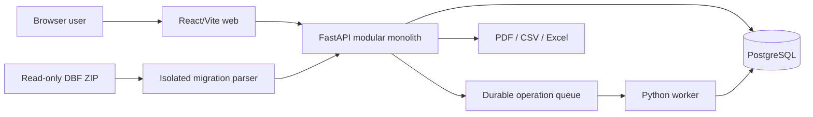

# Architecture

## System shape

CTec General Ledger is a modular monolith deployed as four containers: a React/Vite static web
client, a FastAPI application, a separately runnable Python operation worker, and PostgreSQL.
The API and worker use the same backend package. The legacy VB6 application remains separate and
its DBFs are migration inputs only.

Backend modules separate authentication/context, fiscal calendars, chart of accounts, journal
workflow, posting, budgets/close, reporting, custom reports, administration/imports, audit/jobs,
and migration. They share one database transaction boundary, which is intentional: posting,
closing, and migration require atomic changes across ledger, balances, evidence, and audit data.

## Tenant and authorization boundary

Every tenant request carries an authenticated bearer token and an `X-Company-ID`. The API loads
an active membership, its company-owned role, and that role's capabilities before entering a
route. Tenant tables carry `company_id`; composite keys and foreign keys prevent references to
another company's accounts, periods, batches, entries, reports, roles, staging rows, and close
records. Queries still include explicit company predicates. PostgreSQL is the sole authority;
client state never grants access.

This is logical tenant isolation in a shared schema, not separate databases or PostgreSQL RLS.
Direct database users must therefore be limited to the application/operations roles described in
`SECURITY.md`.

## Accounting model

- Accounts are normalized and company-owned; one retained-earnings account is enforced.
- Fiscal years contain 1–18 ordered periods with explicit dates and status.
- A batch contains one or more entries; an entry contains fixed-decimal debit/credit lines.
- Validation checks active postable accounts, company ownership, open periods, line sides,
  currencies/rates, and base-currency balance.
- Posting locks the batch, revalidates it, creates immutable posting evidence, and mutates
  period balances in one transaction.
- Database triggers reject updates/deletes of posted entries and lines. Corrections are linked
  equal-and-opposite entries.
- Closing appends closing/opening entries and a close event; it never deletes ledger history.
- Reports calculate from the same normalized balances/detail used by the API, and saved runs
  retain parameters, result digest, actor, outcome, and audit events.

## Data and failure boundaries

SQLAlchemy 2 sessions define request transactions. Posting and cutover helpers can participate in
a caller-owned transaction and commit only after all checks succeed. Database constraints remain
the final defense for balance-side, tenant-reference, uniqueness, status, progress, and migration
lineage invariants. Expected errors return stable 4xx responses; unexpected failures roll back on
session close and correlation IDs are returned for log tracing.

Administration jobs are inserted as company-owned PostgreSQL rows. The worker claims queued jobs
with `FOR UPDATE SKIP LOCKED`, so multiple worker processes cannot execute the same claim. Results,
progress, and errors remain durable and visible to authorized users. Local tests may enable the
same runner inline; Compose disables inline execution and uses the worker container.

Architecture decisions are recorded under `docs/adr/`.
